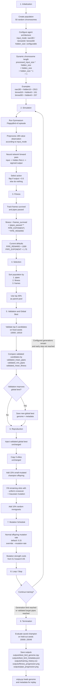

# Flappy Bird Neuroevolution GA Flowchart

```mermaid
flowchart TD
    A["1. Initialization"] --> A1["Create population<br/>50 random chromosomes"]
    A1 --> A2["Configure agent architecture<br/>input_mode: raw180 / binned18 / binned30<br/>hidden_size: configurable"]
    A2 --> A3["Dynamic chromosome length<br/>processed_input_size * hidden_size<br/>+ hidden_size<br/>+ hidden_size * 1<br/>+ 1"]
    A3 --> A4["Examples<br/>raw180 + hidden16 = 2913<br/>binned18 + hidden8 = 161<br/>binned30 + hidden8 = 257"]

    A4 --> B["2. Simulation"]
    B --> B1["Run Gymnasium FlappyBird-v0 episode"]
    B1 --> B2["Preprocess 180-value observation<br/>according to input_mode"]
    B2 --> B3["Neural network forward pass<br/>input -> hidden ReLU -> sigmoid output"]
    B3 --> B4["Select action<br/>flap if output > 0.5<br/>else do nothing"]

    B4 --> C["3. Fitness"]
    C --> C1["Track frames survived<br/>and pipes passed"]
    C1 --> C2["fitness = frames_survived<br/>+ (pipes_passed ** PIPE_EXPONENT)<br/>* PIPE_REWARD"]
    C2 --> C3["Current defaults<br/>PIPE_REWARD = 1000<br/>PIPE_EXPONENT = 1.75"]

    C3 --> D["4. Selection"]
    D --> D1["Sort population by<br/>1. pipes<br/>2. fitness<br/>3. frames"]
    D1 --> D2["Use top 40%<br/>as parent pool"]

    D2 --> E["5. Validation and Global Best"]
    E --> E1["Validate top 5 candidates<br/>on fixed seeds 10000..10019"]
    E1 --> E2["Compare validated candidates by<br/>validated_mean_pipes<br/>validated_min_pipes<br/>validated_mean_fitness"]
    E2 --> E3{"Validation improves<br/>global best?"}
    E3 -- "Yes" --> E4["Save new global best<br/>genome + metadata"]
    E3 -- "No" --> F["6. Reproduction"]
    E4 --> F

    F --> F1["Inject validated global best<br/>unchanged"]
    F1 --> F2["Copy 5 elites<br/>unchanged"]
    F2 --> F3["Add 15% small-mutated<br/>champion offspring"]
    F3 --> F4["Fill remaining slots with<br/>uniform crossover<br/>+ Gaussian mutation"]
    F4 --> F5["Add 10% random immigrants"]

    F5 --> G["7. Mutation Schedule"]
    G --> G1["Normal offspring mutation rate<br/>default: 0.15<br/>override: --mutation-rate"]
    G1 --> G2["Mutation strength cools<br/>from 0.2 toward 0.05"]

    G2 --> H["8. Loop / Stop"]
    H --> H1{"Continue training?"}
    H1 -- "Configured generations remain<br/>and early stop not reached" --> B
    H1 -- "Generation limit reached<br/>or validated target pipes reached" --> I["9. Termination"]

    I --> I1["Evaluate saved champion<br/>on held-out seeds 20000..20049"]
    I1 --> I2["Save outputs<br/>outputs/best_bird_genome.npy<br/>outputs/best_bird_metadata.json<br/>outputs/training_history.csv<br/>outputs/fitness_progression.png<br/>outputs/pipe_progression.png"]
    I2 --> I3["enjoy.py loads genome<br/>and metadata for replay"]
```
